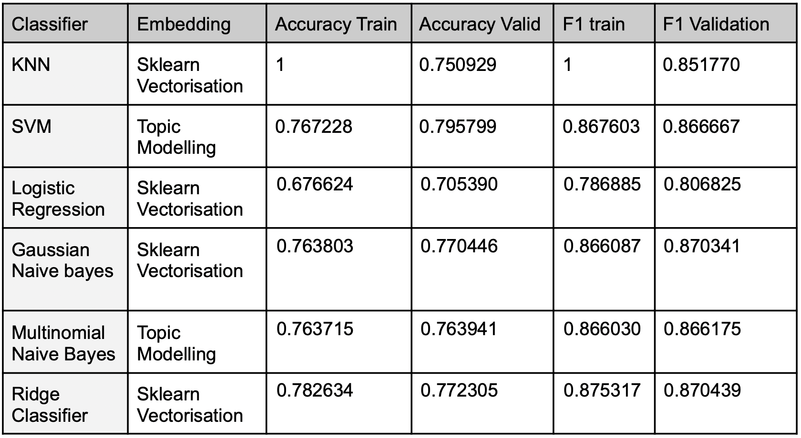
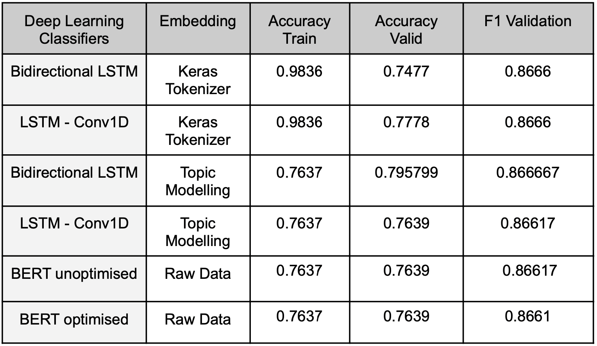

  

# Detection of helpful reviews on IMDB 

# About this project

The aim of this repository is to adjudicate between helpful and unhelpful movie reviews from the IMDB database. To perform this classification task, Natural Language Processing (NLP) tools were used to transform reviews' text to numeric features. Then, different machine learning classifiers and deep learning models were trained and optimised to achieve the highest F1 score in the validation set. Lastly, the chosen model was retrained on the combined dataset and used to classify the test data. 

# Dataset

The training data contains 10,755 labelled reviews. The test data contains 5,071 reviews that are unlabeled. All the reviews included in the dataset have at least 80 votes.
- **train.csv**: your training data (N = 10,755). The first column, ‘’helpfulness_cat”, is the label of each training movie review; the second column, “imdb_user_review”, contains the text of the movie review.
- **test.csv**: your test data (N = 5,071). The first column, “_id”, is a movie review-level identifier; the second column, “imdb_user_review”, is the unlabelled movie review to classify.

# Methodology 

## Natural Language Processing tools

1. Bag of words (BoW)
2. TF-IDF and N-Grams
3. Document to Vector (DocVec)
4. LDA Topic Modeling

## Machine Learning Models

1. Logistic Regression
2. Support Vector Machine
3. K-Nearest Neighbours
4. Gaussian Naive Bayes
5. Multinomial Naive Bayes
6. Ridge Regression

## Deep Learning Neural Networks

1. Bidirectional LSTM (Keras Tokenizer & Topic to Document Probabilities embeddings)
2. LSTM-Conv1D  (Keras Tokenizer & Topic to Document Probabilities embeddings)
3. BERT (uncased)

# Results

The approach of the project was to initiate and train an unoptimised model and then perform hyperparameter tuning to choose the optimised parameters. The models were validated in the validation set and also in training to inspect potential bias in the trained models. 
The results for the machine learning models can be seen here:

   

Then the same approach was followed for the neural networks, providing the following results:

   

Based on the final Training and Validation accuracies and F1 scores, the **Multinomial Naive Bayes** has been chosen with the CountVectorization embedding for the following reason:
- The Deep Learning models showed strange training, despite the different structures and inputs of the networks - the metrics have been very similar and training very flat. 
- The IMDB dataset on hand is quite imbalanced and has not got as many observations to use well for a Neural Network. 
- Naive Bayes is suitable for smaller datasets and for high-dimensional datasets (as in the case with the CountVectorization approach)

Other contributors: [Agam Chug](https://github.com/agamchug),[Georgios Kalfas](https://github.com/georgekalf),[Iliana Panagiotidou](https://github.com/ilipan15) 

